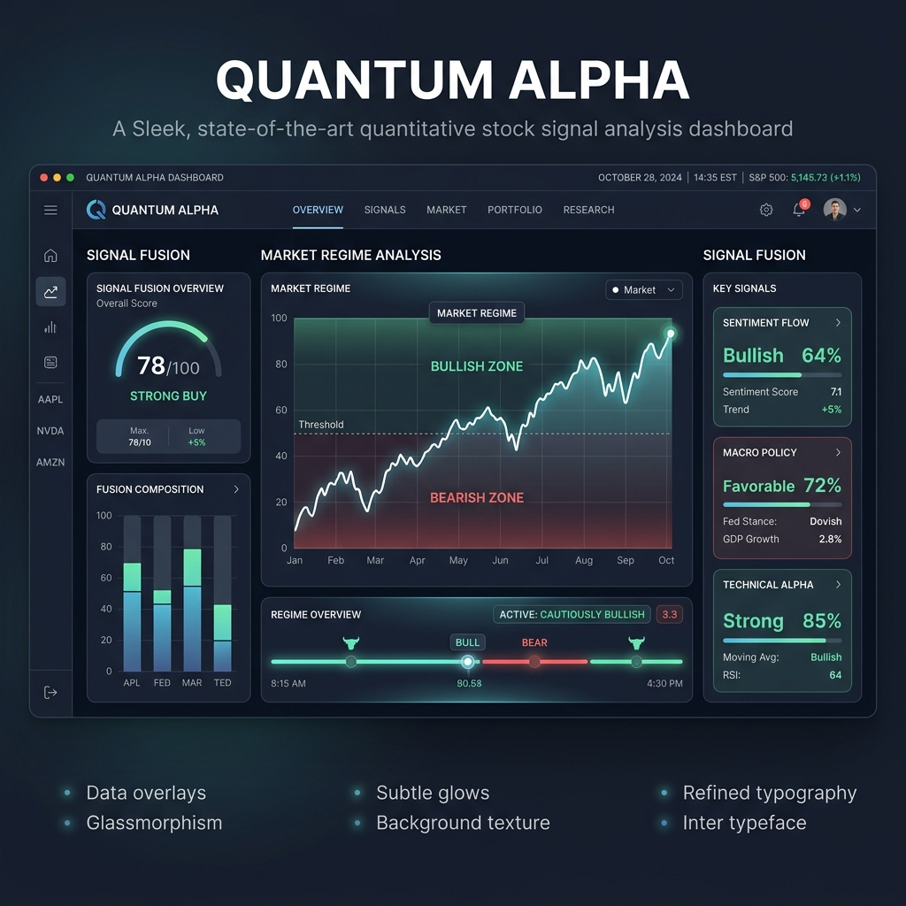

# OptimetricFlow Signals 🚀

<!-- description: OptimetricFlow Signals - An open-source Python toolkit for Multi-Factor Alpha Signal Fusion and Market Regime Detection in quantitative trading. -->

[](https://opensource.org/licenses/MIT)
[](https://www.python.org/downloads/)
[](https://optimetricflow.cn)

**OptimetricFlow Signals** is a high-performance Python library designed for quantitative traders and financial data scientists. It provides a robust framework for transforming structured multi-source signals (news, social media, policy, and macro data) into actionable alpha factors and fused scores.



## 🌟 Key Features

- **Multi-Source Signal Fusion**: Convert diverse data streams into a unified per-symbol factor row.
- **Adaptive Market Regime Detection**: Real-time detection of market states (Bull, Bear, Shock) using MA slope, volatility, and volume analysis via [akshare](https://github.com/akfamily/akshare).
- **Regime-Conditioned Weighting**: Dynamically rescale factor weights based on the current market environment to optimize signal robustness.
- **Extensible Alpha Factory**: Modular architecture for mapping raw signals to event, sentiment, flow, and technical buckets.
- **Schema-First Design**: Clearly defined `UnifiedSignal` and `RelatedStock` schemas for seamless integration into production pipelines.

---

## 🏛️ Architecture & Scope

This repository serves as the **open-source core** and **integration reference** for the OptimetricFlow ecosystem.

### In this Repository

- ✅ **Schemas**: Data contracts for signals and factors.
- ✅ **AlphaFactorFactory**: Mapping logic for signal-to-factor conversion.
- ✅ **SignalAggregator**: Advanced fusion algorithms with regime-dependent multipliers.
- ✅ **RegimeDetector**: Quantitative analysis on major CN indices.

### Handled by [OptimetricFlow Enterprise](https://optimetricflow.cn)

- ❌ Automated factor decay and rolling IC tuning.
- ❌ Live data collection and real-time alerting dashboards.
- ❌ LLM-powered prompt chains for raw text parsing.
- ❌ Full portfolio construction and brokerage execution.

---

## 🚀 Quick Start

### Installation

Install directly from the source for the latest updates:

```bash
# Clone the repository
git clone https://github.com/optimetricflow/optimetricflow-signals.git
cd optimetricflow-signals

# Set up environment
python -m venv .venv
source .venv/bin/activate  # Windows: .venv\Scripts\activate
pip install -U pip
pip install .
```

### Run the Pipeline Example

The bundled example demonstrates the complete flow from fake signal generation to fused alpha scores:

```bash
python examples/alpha_signal_pipeline.py
```

### Market Regime Detection

Detect the current market environment with a single command:

```python
from flowsense_quant import RegimeDetector

detector = RegimeDetector()
# Analyze a weighted basket of indices (e.g., SSE Composite and ChiNext)
result = detector.get_current_regime_weighted(
    indices=[("000001", "sh", 0.6), ("399006", "sz", 0.4)]
)

print(f"Current Market Regime: {result.regime}")
print(f"Metadata: {result.metadata}")
```

---

## 📊 Parameters & Customization

| Component | Default (Illustrative) | Production Usage |
| :--- | :--- | :--- |
| **Base Weights** | `ILLUSTRATIVE_BASE_WEIGHTS` | Replace with your calibrated rolling estimates. |
| **Regime Multipliers** | `ILLUSTRATIVE_REGIME_MULTIPLIERS` | Customize based on your regime-conditioned strategy. |
| **Index Basket** | Single placeholder benchmark | Pass your custom universe to `get_current_regime_weighted`. |

---

## 🔗 Links & Resources

- **Official Website**: [optimetricflow.cn](https://optimetricflow.cn)
- **Documentation**: [Quick Start Guide](docs/quick-start.md)
- **Contact & Support**: [Support Team](mailto:support@optimetricflow.cn)

## 📄 License

This project is licensed under the MIT License - see the [LICENSE](LICENSE) file for details.

---

Built with ❤️ by the **OptimetricFlow Team**

